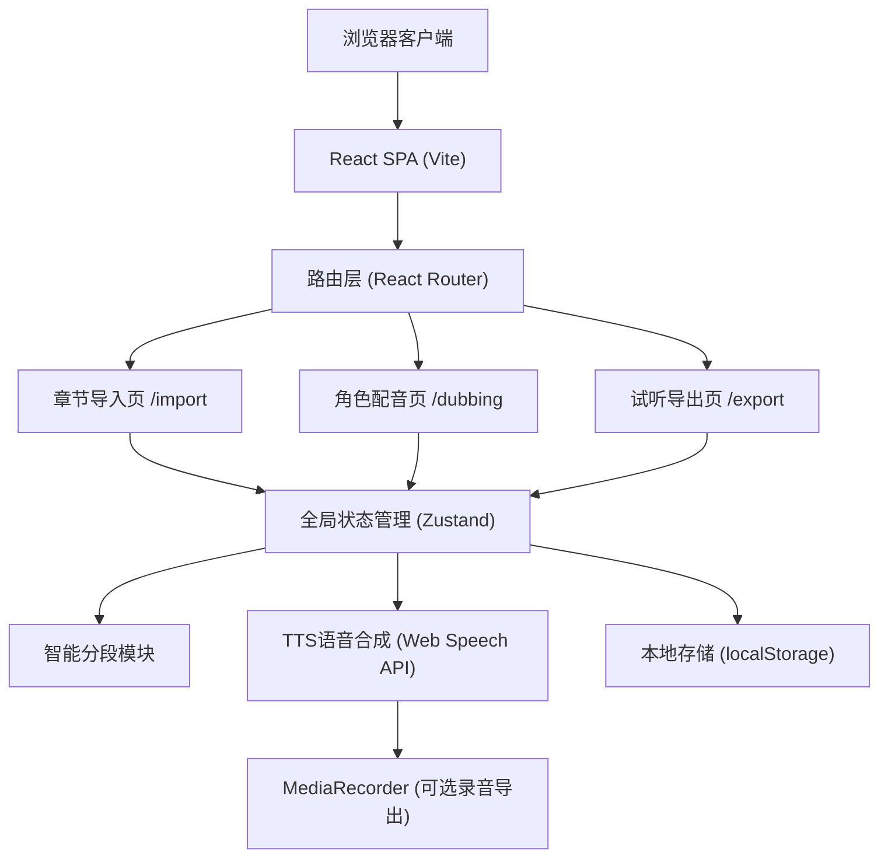

## 1. 架构设计

纯前端单页应用，所有数据与处理均在浏览器端完成，无需后端服务。语音合成使用浏览器内置 Web Speech API，导出功能使用 Blob + URL.createObjectURL 实现本地下载。



## 2. 技术选型

- **前端框架**：React 18.2 + TypeScript 5（类型安全，组件化开发）
- **构建工具**：Vite 5（极速开发体验，原生ESM）
- **路由管理**：React Router Dom 6（声明式SPA路由）
- **状态管理**：Zustand 4（轻量无模板，跨页面共享配音数据）
- **样式方案**：TailwindCSS 3 + 自定义CSS变量（高效样式开发，保持设计系统一致性）
- **语音合成**：Web Speech API (SpeechSynthesis)（浏览器原生，零依赖零成本）
- **图标方案**：Lucide React（简洁现代的开源图标库）
- **动画方案**：Framer Motion（流畅的列表动画与过渡效果）
- **后端服务**：无（纯前端，localStorage持久化）

## 3. 路由定义

| 路由路径 | 页面名称 | 核心功能 |
|----------|---------|---------|
| `/` 或 `/import` | 章节导入页 | 正文输入、智能分段、分段编辑 |
| `/dubbing` | 角色配音页 | 角色标记、风格选择、参数调节、单句试听 |
| `/export` | 试听导出页 | 连续播放、重读标记、文件导出 |

## 4. 核心数据模型（TypeScript 类型定义）

```typescript
// 句子类型
type SentenceType = 'title' | 'dialogue' | 'narration';

// 角色类型
type CharacterType = 'male_lead' | 'female_lead' | 'villain' | 'narrator' | null;

// 声音风格
type VoiceStyle = 'cool' | 'youth' | 'steady' | 'funny' | null;

// 单句数据模型
interface Sentence {
  id: string;                    // 唯一标识 (uuid)
  chapterId: string;             // 所属章节
  type: SentenceType;            // 句子类型
  text: string;                  // 句子文本
  character: CharacterType;      // 分配角色
  voiceStyle: VoiceStyle;        // 声音风格
  rate: number;                  // 语速 0.5 - 2.0, 默认1.0
  pitch: number;                 // 音调 0.5 - 2.0, 默认1.0
  pauseBefore: number;           // 句前停顿(ms) 0-3000
  emotionLevel: number;          // 情绪强度 1-10
  isReread: boolean;             // 是否标记重读
  order: number;                 // 排序序号
}

// 章节数据模型
interface Chapter {
  id: string;
  title: string;
  wordCount: number;
  sentences: Sentence[];
  createdAt: number;
}

// 角色声音配置
interface CharacterVoice {
  character: CharacterType;
  name: string;                  // 显示名称
  style: VoiceStyle;             // 当前选择风格
  voiceURI: string | null;       // 浏览器语音URI
  color: string;                 // 标记颜色
}

// 全局应用状态
interface AppState {
  chapters: Chapter[];
  currentChapterId: string | null;
  selectedSentenceId: string | null;
  characterVoices: CharacterVoice[];
  isPlaying: boolean;
  currentPlayingId: string | null;
  
  // Actions
  addChapter: (title: string, text: string) => void;
  removeChapter: (id: string) => void;
  setCurrentChapter: (id: string) => void;
  updateSentence: (id: string, patch: Partial<Sentence>) => void;
  splitSentence: (id: string, splitIndex: number) => void;
  mergeSentences: (id1: string, id2: string) => void;
  setCharacterVoice: (character: CharacterType, patch: Partial<CharacterVoice>) => void;
  selectSentence: (id: string | null) => void;
  toggleReread: (id: string) => void;
  playSentence: (id: string) => void;
  stopPlaying: () => void;
}
```

## 5. 模块划分

```
src/
├── main.tsx                 # 应用入口
├── App.tsx                  # 顶层路由布局
├── index.css                # Tailwind + 全局样式变量
├── router/
│   └── index.tsx            # 路由配置
├── store/
│   └── useAppStore.ts       # Zustand全局状态
├── pages/
│   ├── ImportPage.tsx       # 章节导入页
│   ├── DubbingPage.tsx      # 角色配音页
│   └── ExportPage.tsx       # 试听导出页
├── components/
│   ├── layout/
│   │   ├── TopNav.tsx       # 顶部导航（含进度指示）
│   │   └── PageContainer.tsx
│   ├── import/
│   │   ├── TextInputArea.tsx    # 正文输入区
│   │   ├── SegmentPreview.tsx   # 分段预览列表
│   │   └── SegmentCard.tsx      # 单段卡片（可编辑）
│   ├── dubbing/
│   │   ├── SentenceList.tsx     # 句子列表
│   │   ├── SentenceItem.tsx     # 单句条目
│   │   ├── CharacterPanel.tsx   # 角色选择面板
│   │   ├── VoiceStylePicker.tsx # 声音风格选择
│   │   └── ParamSliders.tsx     # 语速/停顿/情绪滑块
│   └── export/
│       ├── AudioPlayer.tsx      # 连续播放器
│       ├── Playlist.tsx         # 播放列表
│       └── ExportButtons.tsx    # 导出按钮组
├── hooks/
│   ├── useTTS.ts             # 语音合成Hook
│   └── useSegmentation.ts    # 智能分段Hook
├── utils/
│   ├── segmentation.ts       # 智能分段算法
│   ├── tts.ts                # TTS工具函数
│   ├── export.ts             # 导出工具（WAV/JSON/CSV）
│   └── uuid.ts               # ID生成
└── constants/
    ├── characters.ts         # 角色配置常量
    ├── voiceStyles.ts        # 声音风格常量
    └── colors.ts             # 主题色配置
```

## 6. 智能分段算法说明

输入大段文本，按以下优先级依次处理：

1. **章节标题识别**：匹配行首包含「第X章/回/节/卷」或独立一行且字数≤20的文本，标记为 title 类型
2. **对话识别**：匹配被中文引号「""「」『』」或英文引号包裹的内容，标记为 dialogue 类型
3. **旁白切分**：剩余文本按中文句号「。」、问号「？」、感叹号「！」、省略号「……」切分为独立旁白句，标记为 narration 类型
4. **空行过滤**：去除纯空行和纯空白段落
5. **顺序编号**：为每个分段生成 order 序号，保证播放顺序

## 7. TTS 语音合成方案

使用浏览器原生 `window.speechSynthesis` API：

- **角色映射**：根据 character + voiceStyle 映射到不同 `SpeechSynthesisVoice`，调整 rate/pitch 参数模拟风格差异
  - 男主+沉稳：低音调(0.8)、慢语速(0.9)、男声优先
  - 女主+清冷：中音调(1.1)、中语速(1.0)、女声优先
  - 反派+搞笑：高音调(1.4)、快语速(1.2)、夸张语调
  - 旁白：系统默认语音，标准参数
- **情绪强度**：emotionLevel 1-10，映射为 pitch 微调范围 + volume 调节
- **停顿控制**：句前 pauseBefore 通过 setTimeout 在 speak() 前插入延迟实现
- **连续播放**：维护播放队列，上一句 onend 事件触发下一句
- **可选导出**：使用 MediaRecorder API 捕获 AudioContext 输出，录制为 WAV/MP3（注意：浏览器实现差异，提供降级方案为仅导出配音清单）

